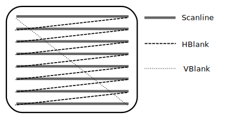

# Chapter 5
## How do I display a background?

### Some Background Information

Since the beginning of time, humans have used raster displays to draw
electronic images. Raster images aren't used too much anymore, in practice.
However, most all displays still act like raster displays from a programming
perspective. Each physical display on the Nintendo DS is actually an LCD screen
which works nothing like a raster display in actuality, but the electronics
that control it provide an interface to the graphics engines on the Nintendo DS
that is very much like a raster display.

So what is a raster display? Put simply, it is just like a television display.
A beam of electrons blasts away at the back of a phosphor coated screen in a
deterministic way (known as a raster scan). The beam, from the perspective of a
person watching the television, travels from left to right, one scan line at a
time. The beam never blast electrons from right to left. After the beam reaches
the right edge of the screen, it turns off and moves to the left edge and down
one line. When the beam finally reaches the bottom line of the screen, it
travels back up to the upper left of the screen and begins this drawing process
all over again. [Figure 5.1, “The Raster Display”](#raster_display) illustrates
this process in an exaggerated fashion.

Two things are important to remember here. First, that the period of time
during which the beam goes from right to left (not drawing anything) is called
the horizontal blanking period, or HBlank. Second, that the period of time
during which the beam goes from bottom to top (again, not drawing anything) is
called the vertical blanking period, or VBlank. Knowing about VBlank is useful
for us as Nintendo DS programmers because it is the period of time in which we
will tell the Nintendo DS to draw things. If we didn't, then the Nintendo DS
display might be in the middle of drawing the screen when we tell it what to
draw. This would give us strange artifacts and is generally undesirable.

<a name="raster_display"></a>

#### Figure 5.1, “The Raster Display”



### The 2D Graphics Engines

The Nintendo DS has two screens. As such, it has two graphics engines, one for
each screen. The first engine is referred to as the "main" engine, while the
second is called the "sub" engine. Both of these engines can put in charge of
either screen. By default, libnds tells the main engine to operate the top
physical screen and the sub screen the bottom physical screen.

Each engine supports up to four backgrounds and up to 128 sprites. They operate
independently of each other, each with their own control registers,
backgrounds, sprites, graphics data, and palettes. To use an engine, we must
first turn them on. Then we place the engine into a certain mode of operation.
Next, we map memory for use with the engines. Finally, we load their memory
with graphics data and palettes and they automatically just draw what we've set
them up to do.

### The Fifth Mode

Each of these graphics engines can be placed into one of seven different modes
that support different features. In this manual, we'll cover one of the more
common graphic modes, Mode 5. It is commonly used because it is very flexible
and allows for some amazing special effects. We'll learn how to display
multiple 15-bit color 1-bit alpha affine[^affine] backgrounds in this chapter.
Mode 5 consists of four different backgrounds each with their own capabilities.
[Table 5.1, “Mode 5 Information”](#mode_5_information) shows how flexible Mode
5 can be.

<a name="mode_5_information"></a>

#### Table 5.1, “Mode 5 Information”

| Background | Purpose |
| ---------- | ------- |
| 0 | Tiled Mode, 2D with 3D support |
| 1 | Tiled Mode, 2D |
| 2 | Extended Rotation Background |
| 3 | Extended Rotation Background |

### A Fine Affine Background

An affine background, also known as an external rotation background or "exrot"
background, is one that has the ability to be transformed by an affine
transformation matrix[^affine_transformation_matrix]. Since linear algebra is
beyond the scope of this manual, I will cover briefly how to set up a basic
affine background, but not get into rotating, scaling, or sheering it. For this
manual, we'll just apply an identity transform, a transform that doesn't
actually change the background, to our backgrounds. With an affine
transformation matrix, you can rotate, scale, and sheer an affine background,
among other interesting effects. If you want to learn about the cool effects
you can do with an affine background and an affine transformation matrix, I
recommend you look at Cearn's tutorial on affine transformations at
<http://www.coranac.com/tonc/text/affine.htm>.

### Coding with this Manual

Since this is the first time in this manual where we'll start to write code, we
should be aware of the resources available to assist us in following along with
this manual. If you haven't already done so, download the sources that
accompany this manual from the manual homepage at <http://patater.com/manual>.
After extracting the sources, you'll find a folder called `code`. The manual
provides a template for you to use with this manual and any other Nintendo DS
programming projects you might wish to start developing. This template is
located in the `code` folder and is itself a folder called
`chapter_0-starting_system`. The `code` folder also contains project folders
for each chapter. If at anytime you get stuck or if you want to skip a chapter,
feel free to refer the completed project for the chapter you are stuck on or to
grab the completed project for the chapter prior to the one you wish to skip
to. To follow along with this manual, copy the `chapter_0-starting_system`
folder to a nice place you wish to work from (I'd copy the folder to my
`~/projects` directory and name the copy `manual`) and open `source/main.cpp`
with your favorite text editor. (My favorite text editor is vim.) Let's get
going!

### Initializing the Hardware

In order to get the hardware to do what we want, we have to first initialize
it. This means turning on the 2D graphics core. This is where we first fall in
love with libnds. (We'll fall in love with it repeatedly over the course of
this manual.) libnds makes it incredibly simple to do these two things. Add the
following code to your new `main.cpp` C++ code file.

```C++
#include <nds.h>

int main() {
  /*  Turn on the 2D graphics core. */
  powerOn(POWER_ALL_2D);

  return 0;
}
```

### Configuring the VRAM Banks

After we get the basic setup done, we now have to tell the graphics engine
where to get its display data from. The two graphics engines share the same
VRAM; i.e. There are not two VRAM A banks, one for the main screen and one for
the sub screen. We'll use these memory locations when we load the graphics
later. Let's make a function called `initVideo()`.

```C++
void initVideo() {
  /*
   *  Map VRAM to display a background on the main and sub screens.
   *
   *  The vramSetPrimaryBanks function takes four arguments, one for each of
   *  the major VRAM banks. We can use it as shorthand for assigning values to
   *  each of the VRAM bank's control registers.
   *
   *  We map banks A and B to main screen background memory. This gives us
   *  256KB, which is a healthy amount for 16-bit graphics.
   *
   *  We map bank C to sub screen background memory.
   *
   *  We map bank D to LCD. This setting is generally used for when we aren't
   *  using a particular bank.
   */
  vramSetPrimaryBanks(VRAM_A_MAIN_BG_0x06000000,
                      VRAM_B_MAIN_BG_0x06020000,
                      VRAM_C_SUB_BG_0x06200000,
                      VRAM_D_LCD);

  /*  Set the video mode on the main screen. */
  videoSetMode(MODE_5_2D | // Set the graphics mode to Mode 5
         DISPLAY_BG2_ACTIVE | // Enable BG2 for display
         DISPLAY_BG3_ACTIVE); //Enable BG3 for display

  /*  Set the video mode on the sub screen. */
  videoSetModeSub(MODE_5_2D | // Set the graphics mode to Mode 5
          DISPLAY_BG3_ACTIVE); // Enable BG3 for display
}
```

There are nine VRAM banks in total on the Nintendo DS. See [Table 5.2, “VRAM
Bank Information”](#vram_bank_information) for details about them. Our 16-bit
background images take up 128KB of memory each. Thus, each background has to
have one whole VRAM bank assigned to it. Not all VRAM banks can be used for all
purposes, however. Refer to [Appendix A](vram.md), for more detailed information.

<a name="vram_bank_information"></a>

#### Table 5.2. VRAM Bank Information

| VRAM Bank | Control Register Address | Control Register | VRAM Bank Size |
| --------- | ------------------------ | ---------------- | -------------- |
| `VRAM_A` | `0x04000240` | `VRAM_A_CR` | 128KB |
| `VRAM_B` | `0x04000241` | `VRAM_B_CR` | 128KB |
| `VRAM_C` | `0x04000242` | `VRAM_C_CR` | 128KB |
| `VRAM_D` | `0x04000243` | `VRAM_D_CR` | 128KB |
| `VRAM_E` | `0x04000244` | `VRAM_E_CR` | 64KB |
| `VRAM_F` | `0x04000245` | `VRAM_F_CR` | 16KB |
| `VRAM_G` | `0x04000246` | `VRAM_G_CR` | 16KB |
| `VRAM_H` | `0x04000248` | `VRAM_H_CR` | 32KB |
| `VRAM_I` | `0x04000249` | `VRAM_I_CR` | 16KB |

### Setting up the Affine Backgrounds

libnds helps us once again by provide a nice API[^api] for accessing the affine
transformation matrix of a particular affine background. libnds provides access
to a background's affine transformation matrix through four variables. [Figure
5.2, “libnds Affine Background API”](#libnds_affine_bg_api) shows the names of
these variables and which part of the affine transformation matrix they align
with.

<a name="libnds_affine_bg_api"></a>

#### Figure 5.2. libnds Affine Background API


What we'll do now is add three backgrounds. We'll put a splash screen on the
top physical screen, a starfield on the bottom physical screen, and a planet
placed atop the starfield background. To do this, we'll use `SUB_BG3` (although
we could use `SUB_BG2`) for the splash screen and both backgrounds 2 and 3 on
the main screen for the planet and starfield respectively. In order to make
sure the planet shows up above the starfield as opposed to below it, we give
the planet a priority number less than that of the starfield's priority number.
Relatively lower priority numbers place backgrounds relatively above other
backgrounds. There are only four priority numbers per graphics engine that we
can assign to backgrounds (priority numbers 0-3).

We'll now use that nice API libnds provides us for both the background control
registers and the affine transformation matrix. Let's proceed to make a
function called `initBackgrounds()` which will set up our affine backgrounds.
Explanations of what is going on is the comments.

```C++
void initBackgrounds() {
  /*  Set up affine background 3 on main as a 16-bit color background. */
  REG_BG3CNT = BG_BMP16_256x256 |
         BG_BMP_BASE(0) | // The starting place in memory
         BG_PRIORITY(3); // A low priority

  /*  Set the affine transformation matrix for the main screen background 3
   *  to be the identity matrix.
   */
  REG_BG3PA = 1 << 8;
  REG_BG3PB = 0;
  REG_BG3PC = 0;
  REG_BG3PD = 1 << 8;

  /*  Place main screen background 3 at the origin (upper left of the
   *  screen).
   */
  REG_BG3X = 0;
  REG_BG3Y = 0;

  /*  Set up affine background 2 on main as a 16-bit color background. */
  REG_BG2CNT = BG_BMP16_128x128 |
         BG_BMP_BASE(8) | // The starting place in memory
         BG_PRIORITY(2);  // A higher priority

  /*  Set the affine transformation matrix for the main screen background 3
   *  to be the identity matrix.
   */
  REG_BG2PA = 1 << 8;
  REG_BG2PB = 0;
  REG_BG2PC = 0;
  REG_BG2PD = 1 << 8;

  /*  Place main screen background 2 in an interesting place. */
  REG_BG2X = -(SCREEN_WIDTH / 2 - 32) << 8;
  REG_BG2Y = -32 << 8;

  /*  Set up affine background 3 on the sub screen as a 16-bit color
   *  background.
   */
  REG_BG3CNT_SUB = BG_BMP16_256x256 |
           BG_BMP_BASE(0) | // The starting place in memory
           BG_PRIORITY(3); // A low priority

  /*  Set the affine transformation matrix for the sub screen background 3
   *  to be the identity matrix.
   */
  REG_BG3PA_SUB = 1 << 8;
  REG_BG3PB_SUB = 0;
  REG_BG3PC_SUB = 0;
  REG_BG3PD_SUB = 1 << 8;

  /*
   *  Place main screen background 3 at the origin (upper left of the screen)
   */
  REG_BG3X_SUB = 0;
  REG_BG3Y_SUB = 0;
}
```

### Fixed Point Number Primer

What's up with all those `<< 8` thingies? Those are fixed point numbers. The
Nintendo DS expects many values to be in varying fixed point formats. A fixed
point number is simply a way of specifying multiples of fractions to represent
non-integer values. For example, if we use an integer variable to store a US
Dollar amount, we might initially think we can only represent whole dollar
values. However, if we decide to store US pennies in the integer as opposed to
whole dollar values, we can all of a sudden represent fractions of US Dollars
with our integer. We can have 1.21 US Dollars by saying we have 121 pennies.

Common notation for fixed point types looks like 1.31, 1.7.24, 8.8, and etc. To
interpret this notation, we read from right to left. First, we find the number
of bits used to specify fractional parts. The next number will be the number of
bits for whole number parts. And, if there is another number, it will usually
indicate the sign of the number as being either positive or negative with one
bit. [Figure 5.3, “Integer variables can be used to represent
fractions.”](#fixed_point) illustrates the concept of fixed point numbers.


<a name="fixed_point"></a>

#### Figure 5.3. Integer variables can be used to represent fractions.


### The Basics of DMA

DMA stands for Direct Memory Access. DMA allows the reading and writing of
memory independently of the CPU. The Nintendo DS has special, dedicated DMA
hardware to do quick and moderately effcient moving of memory. DMA is not very
efficient for memory fill operations, however, as the data to fill with needs
to be read once for every write. Libnds provides us with a few functions to
make use of the DMA hardware in the Nintendo DS.

Whenever you have the opportunity to use DMA, you should. It is always better
to use DMA than to use a for loop to copy data. When using DMA to copy from
main memory, do not forget to flush main memory before using DMA. The DMA
doesn't use the cache where the relevant memory may currently be stored, so
flushing to main memory guarantees that DMA sees the correct data. Another
issue to consider would be that in the middle of a DMA, the main CPUs are
prevented from using certain memory hardware<!--(XXX bus contention or
something?)-->. This can cause awkward bugs with interrupt handling. For this
reason, and `swifastcopy()` may be safer, and is not too much slower. The
safest bet is always `memcopy()` and `memset()`, if you are running into some
bugs.

The declaration of `dmaCopyHalfWords()` from libnds is as follows.

```C++
static inline void
dmaCopyHalfWords(
    uint8 channel,
    const void * source,
    void * dest,
    uint32 size
);
```
In our program, we will use `dmaCopyHalfWords()` to load some graphics into
memory. We use the function `dmaCopyHalfWords()` instead of `dmaCopy()` because
it is more explicit as to how it is copying and it lets us specify which DMA
channel to use when copying. We'll use the same channel (channel 3) that the
ordinary `dmaCopy()` uses, though.

Let's start out by writing some functions to display our backgrounds. Since
we've already set up the hardware to display the data in the desired manner,
right after the copy we will get some nice images displayed on our screens. If
we didn't set up our backgrounds first, we'd most likely get garbage on the
screen until we eventually did set up the background control registers.

```C++
/* Select a low priority DMA channel to perform our background
 * copying. */
static const int DMA_CHANNEL = 3;

void displayStarField() {
  dmaCopyHalfWords(DMA_CHANNEL,
           starFieldBitmap, /* This variable is generated for us by
                     * grit. */
           (uint16 *)BG_BMP_RAM(0), /* Our address for main
                         * background 3 */
           starFieldBitmapLen); /* This length (in bytes) is generated
                       * from grit. */
}

void displayPlanet() {
  dmaCopyHalfWords(DMA_CHANNEL,
           planetBitmap, /* This variable is generated for us by
                  * grit. */
           (uint16 *)BG_BMP_RAM(8), /* Our address for main
                         * background 2 */
           planetBitmapLen); /* This length (in bytes) is generated
                    * from grit. */
}

void displaySplash() {
  dmaCopyHalfWords(DMA_CHANNEL,
           splashBitmap, /* This variable is generated for us by
                  * grit. */
           (uint16 *)BG_BMP_RAM_SUB(0), /* Our address for sub
                           * background 3 */
           splashBitmapLen); /* This length (in bytes) is generated
                    * from grit. */
}
```

### Working with the Makefile

The default template makefile will turn your graphic files into object files
for linking into your program. Never include data as a header file.

The graphics must be in a lossless image format, such as gif, tif, bmp, or png
in order to work with the provided template makefile. I prefer the png graphic
format. Image conversion is usually done by a program called `grit`. The
provided template makefile will ask `grit` to convert images in the `gfx`
folder of your project root to a format ready for the Nintendo DS.

The provided template makefile, adapted from the default libnds template
makefile, is a good base for most all projects. It will look in a folder called
`gfx` (in the same directory as the makefile) for your graphics. If any are
found, it uses a special bin2o rule to tell grit to turn your images into `.o`
files, according to grit rule files (with the `.grit` files extension), which
can be linked into your program. `grit` will create a header file (.h) for your
data. The name format for them works like so: if a file is called
`orangeShuttle.png` the header file will be called `orangeShuttle.h`. Inside
this header file will be a reference to the data in the `.o`, named
`orangeShuttleTiles` and `orangeShuttlePal` or `orangeShuttleBitmap`, depending
on how the grit file specifies which format to convert your image into. It will
also include the length in bytes of the data references as
`orangeShuttleTilesLen` and `orangeShuttlePalLen` or `orangeShuttleBitmapLen`.

For our project, we'll be putting the our graphic files and grit rule files
into the `gfx` directory and having the makefile use `grit` on them.

### Gritty Crash Course

With the emergence of the awesome and multi-platform tool, `grit` there is no
reason to not learn how to use it. It is now a standard tool in Nintendo DS and
GBA development where afore to there was no universal method of image
conversion.

To use grit, we make a grit rule file. This file has the .grit file extension
an contains important information telling grit how we want our image converted.
You can learn about how grit works by reading its built-in help by running the
command `grit` with no parameters. I've also provided commented grit rule files
for all images we will use in this manual. These make good examples and can
help you get the hang of using grit.

For more information regarding grit, you can visit the project homepage and
read the grit manual at <http://www.coranac.com/projects/grit/> and
<http://www.coranac.com/man/grit/html/grit.htm> respectively. You can also
download the latest version of grit from the grit project homepage.

### Putting in the Star Fields

Let's now put these functions into our `main()` function to get everything
working together.

```C++
#include <nds.h>

#include "starField.h"
#include "planet.h"
#include "splash.h"

/* Other functions we've made are here. */

int main() {
  /*  Turn on the 2D graphics core. */
  powerOn(POWER_ALL_2D);

  /*  Configure the VRAM and background control registers. */
  lcdMainOnBottom(); // Place the main screen on the bottom physical screen
  initVideo();
  initBackgrounds();

  /*  Display the backgrounds. */
  displayStarField();
  displayPlanet();
  displaySplash();

  return 0;
}
```

### Compiling

Check over your code, referring to the included examples if needed. Make sure
you have the graphics files and the grit rule files in the `gfx` directory in
your project directory. Bring up the command line and set your current working
directory to the directory which contains the makefile for your project. Type
`make` and if all goes well, you'll have good success.

See [Figure 5.4, “The program should look like this when
run.”](#chapter_5_screen_shot). Copy your program to your DS using the method
you have chosen.


<a name="chapter_5_screen_shot"></a>

#### Figure 5.4. The program should look like this when run.


[^affine]: Affine
[^affine_transformation_matrix]: Affine transformation matrix
[^api]: Application programming interface
