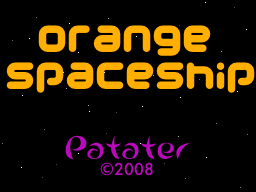

# Chapter 7
## Nintendo DS Input Systems

### Overview

The Nintendo DS has many different user input systems, including buttons, touch
screen, and a microphone. Most video game systems only have buttons and an
analog stick or two. While the Nintendo DS does not have an analog stick, it
does have an amazing touch screen which has millions of different creative
uses. We will only cover the touch screen and buttons, though. If you wish to
learn more about the microphone, I'd recommend reading, although a bit
outdated, the only microphone resource I know of
<http://www.double.co.nz/nintendo_ds/nds_develop9.html>.

### Key Input

libnds provides us with a very nice abstraction for key input. Instead of
having to AND registers with cryptic masks to discover which keys we are
pressing, we simply call `scanKeys()`, then check one of three input functions,
`keysDown()`, `keysHeld()`, or `keysUp()`. In order to see which keys have been
recently pressed, use `keysDown()`. To see which keys are currently held, use
`keysHeld()`. To see which keys have just been released, use `keysUp()`. libnds
provides us with defines for some key masks as well. How they are set up is
explained in [Table 7.1, “libnds Key Defines”](#libnds_key_defines).

<a name="libnds_key_defines"></a>

#### Table 7.1. libnds Key Defines

| Key Define | Mask Bit | Associated Input |
| ---------- | -------- | ---------------- |
| `KEY_A` | `1 << 0` | A Button |
| `KEY_B` | `1 << 1` | B Button |
| `KEY_SELECT` | `1 << 2` | Select Button |
| `KEY_START` | `1 << 3` | Start Button |
| `KEY_RIGHT` | `1 << 4` | Right D-pad |
| `KEY_LEFT` | `1 << 5` | Left D-pad |
| `KEY_UP` | `1 << 6` | p D-pad |
| `KEY_DOWN` | `1 << 7` | Down D-pad |
| `KEY_R` | `1 << 8` | R Button |
| `KEY_L` | `1 << 9` | L Button |
| `KEY_X` | `1 << 10` | X Button |
| `KEY_Y` | `1 << 11` | Y Button |
| `KEY_TOUCH` | `1 << 12` | Pen Touching Screen (no coordinates) |
| `KEY_LID` | `1 << 13` | Lid shutting (useful for sleeping) |

### Touch!

Utada Hikaru (<https://www.youtube.com/watch?v=bYoVeIGl0ao>) wants to touch it.
You have to code it. Let's go!

[](https://www.youtube.com/watch?v=bYoVeIGl0ao)

The touch screen a big part of what makes the Nintendo DS awesome. The libnds
API for using it is cake easy too. We'll be ready for Utada Hikaru in no time.
Whenever you want to read the current touch location, simply call the function
`touchRead()`. This function assigns values to a struct that contains the x and
y coordinate of the touch. You use it like so.

```C++
{{#include snippets/input/1/main.cpp:touch_stuff}}
```

#### What is the IPC?

<!-- Note -->
You may see code that uses something called the IPC to interact with the touch
screen. Use of the IPC struct is deprecated. This means that you shouldn't use
it and should not depend on it being there in the future. The method we use to
read values from the touch screen does not use the IPC struct and is safe for
future use.

### Writing an Input Updating Function

Now that we know a bit about how input is laid out on the Nintendo DS, let's
write a function in our `main.cpp` to collect the input for us. We'll call it
`updateInput()`. We'll use this function as the first thing we call in our
complete game loop.

```C++
{{#include snippets/input/1/main.cpp:update_input}}
```

### Writing an Input Handling Function

This function will be part of our game state updating game loop component. It
will react to outside input and modify the game state accordingly. As such, it
will have to know about and be able to modify the game state. We'll pass the
game state to it as function parameters. Let's call the function
`handleInput()`.

First, we want the ship to accelerate when we press up. To do this, we detect
when the Nintendo DS has the up key on the D-pad held (which included the
initial down press) and accelerate the ship if so. The up key will constantly
read as held, so long as it is held. Reading the input does not affect the keys
register. We'll do similar things for each of the other keys. See if you can
tell what each key does from the code listing below.

```C++
{{#include snippets/input/1/main.cpp:handle_input}}
```

As you've noticed, having that Ship class made input handling extremely easy.
Our keys will directly affect various properties of the ship as we press them.
This is really amazing, but the true miracle is yet to come.

As for the moon, since we didn't make one class for it, the code came together
a little more messily. We also had to pass two parameters to the
`handleInput()` function to represent the moon portion of the game state
instead of one. If we had wanted to be more clean, we could have even produced
a game state struct that contained all the game state and all operations on it
in one place.

### Creating the Main Game Loop, Again

Let's check back in on our `main()` function now. We need to make some
adjustments to our game loop since we've now added the ability to collect input
and to react to input. The first thing we now want to happen in our game loop
is for the key registers and read touch screen coordinates to get updated. We
make a call to `updateInput()` and it all happens for us. Next, we handle the
input we just received by calling our recently created `handleInput()`
function, passing in our game state so that it can change it for us. Everything
else is as before.

```C++
{{#include snippets/input/1/main.cpp:main}}
```

### Compiling

Again, we should double check that we have all the proper includes before
compiling.

```C++
{{#include snippets/input/1/main.cpp:headers}}
```

Now we can control our ship with the D-Pad. What fun! The game should now
appear as in [Figure 7.2, “Flying around in the Orange
Shuttle”](#chapter_7_screen_shot). Now if only we had some aliens to kill…


<a name="chapter_7_screen_shot"></a>

#### Figure 7.2. Flying around in the Orange Shuttle




